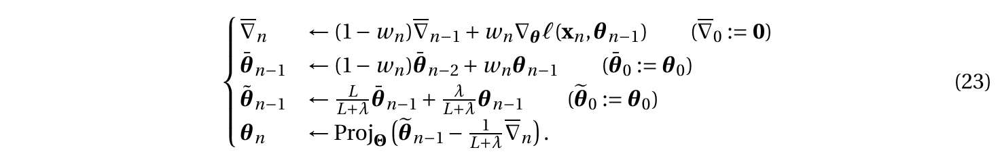
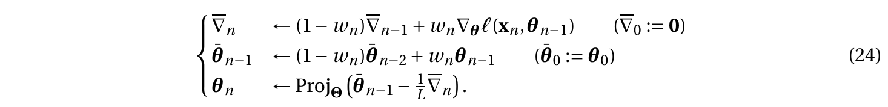
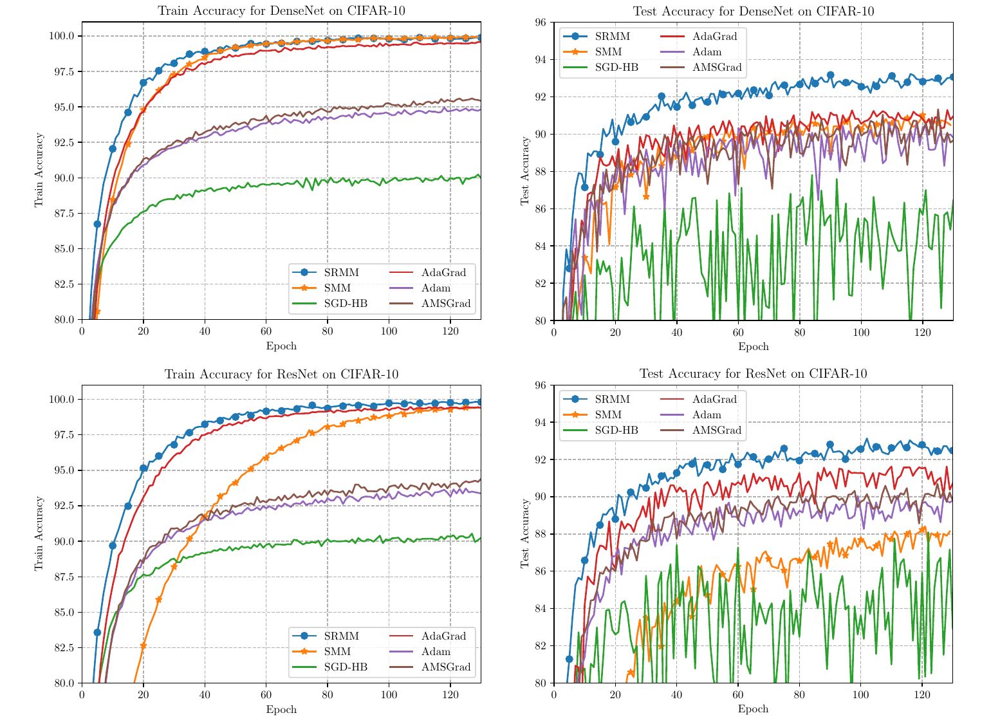

# SRMM
Stochastic Regularized Majorization-Minimization (SRMM)

Hanbaek Lyu,\
[*"Stochastic regularized block majorization-minimization with weakly convex and multi-convex surrogates*"](https://arxiv.org/abs/2201.01652) (arXiv 2023)

Stochastic majorization-minimization (SMM) is a class of stochastic optimization algorithms that proceed by sampling new data points and minimizing a  recursive average of surrogate functions of an objective function. We propose an extension of SMM called *Stochastic Reguarlized Majorizaiton-Minimizaiton* (SRMM) where surrogates are allowed to be only weakly convex or block multi-convex, and the averaged surrogates are approximately minimized with proximal regularization or block-minimized within diminishing radii, respectively.

In this repository, we provide a special version of SRMM proposed in the reference below, where prox-linear surrogates with proximal regularization is used. The resulting algorithm is equivalent to the following iterates  

Setting $\lambda=0$ reduces it to the following `double-averaging PSGD', which was first investigated by  Nesterov and Shikhman in 2015:

## CIFAR-10 Demo using DenseNet-121 and ResNet-34: 

## File description 

  1. **src.SRMM.py** : main algorithm source file that implements the SRMM algorithm in (23) 
  2. **demos.cifar10**: contains scripts for generating the DenseNet and ResNet training/testing accuracies figure 
  
## Author

* **Hanbaek Lyu** - *Initial work* - [Website](https://hanbaeklyu.com)

## License

This project is licensed under the MIT License - see the [LICENSE.md](LICENSE.md) file for details
